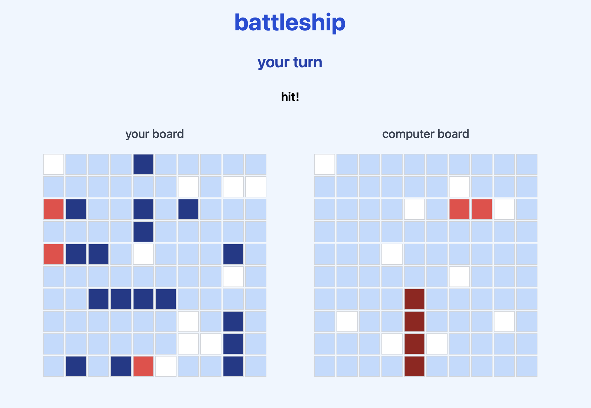

# battleship

**battleship** is a turn-based game built with React 19 + Vite, featuring dynamic ship placement, turn logic, and responsive UI. But this project is not just a game - I went deep on testing, game logic, and component isolation, writing unit tests with Vitest and React Testing Library to ensure every move, render, and game state works perfectly.

---

## features

- interactive **ship placement**
  - manual placement logic
  - auto-placement with validation
- full **turn-based game mechanics** with visual hit/miss feedback
- **victory detection** and state reset
- **test coverage**:
  - game logic (Board, Ship, validation)
  - UI components (`GameSetup`, `Board`, `Cell`, `GamePage`)
  - state management and events

---

## tech stack

- **frontend**: React 19 + Vite
- **styling**: CSS Modules
- **testing**: Vitest, React Testing Library

---

## what I learned

- how to design game logic cleanly and modularly
- deep dive into test-driven development for frontend apps
- mocking and isolating logic for unit test coverage

---

## next steps

- add difficulty levels for AI
- enable drag-to-place ships with orientation toggle
- multiplayer support (websocket)
- track scores across games

---

i am currently building out my portfolio — learning fast, building fast, and refining my craft every day. if this project speaks to you, feel free to [connect with me](https://github.com/ssendns). i am always open to collaborating on cool, meaningful projects.
